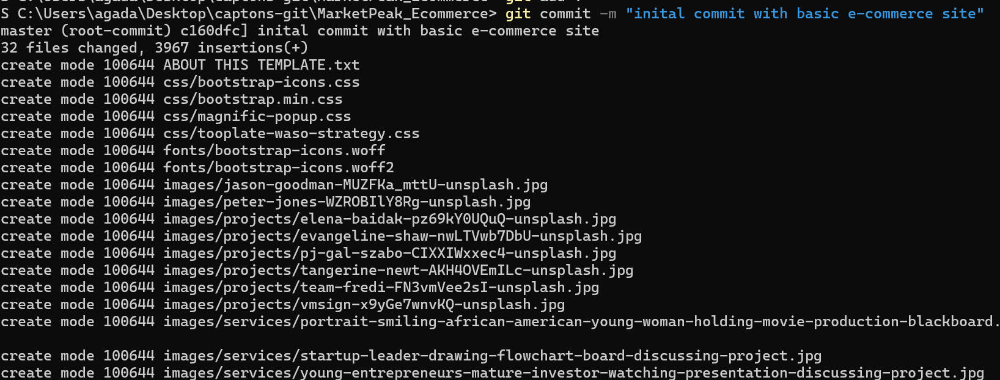

## Capstone Project: Ecommerce Platform Deployment with git, Linux and AWS

1. ### Implementing version control with git
### ✅ Firstly creating a project directory name "MarketPeak_Ecommerce" and initialize it with git 
```
mkdir MarketPeak_Ecommerce
cd MarketPeak_Ecommerce
git init
```
### ✅ Obtain and prepare The E-Commerce Website Template: 
To save time am able to download a pre-existing e-commerce template and extract it into the MarketPeak_Ecommerce. You can access this link https://www.tooplate.com. Or perhaps design your own website from scratch.

### ✅ Stage and Commit the the Template to Git:

a. using the command below
```
git add .
git config --global user.name "YourUsername"
git config --global user.email "youremail@example.com"
git commit -m "Initial commit with basic e-commerce site structure"

```
### ** using git add to add all files to commit **


while trying to congifure my git it shows it's already a multiple values meaning the git is present and to resolve it where it will take a new config i had to use ** --replace-all to reset the git configuration **


Then i commit the files using git commit


### ✅ Pushing code into github repo:
I create a repository on github page name it MarketPeak_Ecommerce


```
git remote add origin https://github.com/MarketPeak_Ecommerce/MarketPeak_Ecommerce.git
```
and push your code with

```git push -u origin main```

2. ### AWS Deploy
### ✅ Setting up an EC2 instance:
Logging into my AWS Management console and launching an EC2 instance using an Amazon Linux 


### ✅ Using ssh to login my instance. ssh i created-key Ec2user@my-Public-ip
created key is the key that i created on the management console 


### ✅ I can now copy the ssh code from the github repo. Also you can use http but for this project i stick with ssh.


### ✅ Using the ssh method of cloning repo on my Ec2 instance.
```
git clone git@github.com:yourusername/MarketPeak_Ecommerce.git
```
where yourusername == your github name.

### ✅ This showed a result that git is not in the instance. so i have to install git for it to be able to work


### ✅ install git into the Amazon linux using the command
```
sudo yum update -y
sudo yum install git -y
```


### ✅ Then you can retry your ssh cloning which will work now


### ✅ You can update and then install apache web server into the ec2 instance terminal.
The apache web server is a server that allow one to host a web.


### ✅ You need to copy the MarketPeak_Ecommerce directory into the httpd so that it can be able to display it on the server

```
sudo rm -rf /var/www/html/*
sudo cp -r ~/MarketPeak_Ecommerce/* /var/www/html/
```


### ✅ After then you will do system reload to reload the apache web server

```
sudo systemctl reload httpd
```


### ✅ Now it remain to access your page on the webpage. But this won't go. so you need to go to the instance and check the security


### ✅ Under the security detail you will click on security group


### ✅ Then click on add rules and choose All TCP (which allows https access on our instance ip) and choose the 0.0.0.0/0 this allow any system to be able to access our public ip. 


3. ### continuous integration and Deployment

### ✅ After now i created a new branch called development
and commit into the branch


### ✅ Then i merged the development branch to the main branch for the update i have made on the project. I create a pull request


### ✅ And now git push into origin main


### ✅ From my ec2 instance terminal i can now pull from origin main so it will gets the new update into my instance repo


`` sudo systemctl reload httpd ``


### ✅ Now i can now copy the updated folder into my httpd folder

```
sudo rm -rf /var/www/html/*
sudo cp -r ~/MarketPeak_Ecommerce/* /var/www/html/
```
### in my case its only the index files i made change so i can use

`` sudo cp /home/ec2-user/MarketPeak_Ecommerce/index.html  /var/www/html/index.html``


### ✅ And reload the page so the changes can now reflect on my deployed page. 
